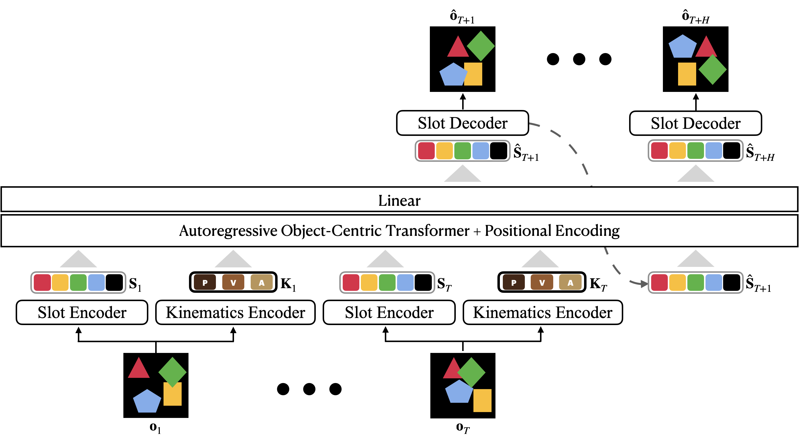

# Unsupervised Dynamics Prediction with Object-Centric Kinematics
<p align="center"></p>
<p align="center"> Yeon-Ji Song, &nbsp; Suhyung Choi, &nbsp; Jaein Kim, &nbsp; Jin-Hwa Kim, &nbsp; Byoung-Tak Zhang </p>
<p align="center">
    <a href="https://arxiv.org/abs/2404.18423" target="_blank">Paper</a>
<!--   , <a href="https://chongyi-zheng.github.io/stable_contrastive_rl">website</a> -->
</p>
*Abstract*: Human perception involves discerning complex multi-object scenes into time-static object appearance (\ie, size, shape, color) and time-varying object motion (\ie, location, velocity, acceleration). This innate ability to unconsciously understand the environment is the motivation behind the success of dynamics modeling. Object-centric representations have emerged as a promising tool for dynamics prediction, yet they primarily focus on the objects' appearance, often overlooking other crucial attributes. In this paper, we propose Object-Centric Kinematics (OCK), a framework for dynamics prediction leveraging object-centric representations. Our model utilizes a novel component named object kinematics, which comprises low-level structured states of objects' position, velocity, and acceleration. The object kinematics are obtained via either implicit or explicit approaches, enabling comprehensive spatiotemporal object reasoning, and integrated through various transformer mechanisms, facilitating effective object-centric dynamics modeling. Our model demonstrates superior performance when handling objects and backgrounds in complex scenes characterized by a wide range of object attributes and dynamic movements. Moreover, our model demonstrates generalization capabilities across diverse synthetic environments, highlighting its potential for broad applicability in vision-related tasks.

This repository contains code for running Object-Centric Kinematics algorithm.

## Installation
### Create Conda Env
Install and use the included anaconda environment.
```
```

### Dependencies
### Training
### Evaluation

## Questions
If you have any questions, comments, or suggestions, please reach out to Yeon-Ji Song (yjsong@snu.ac.kr)
