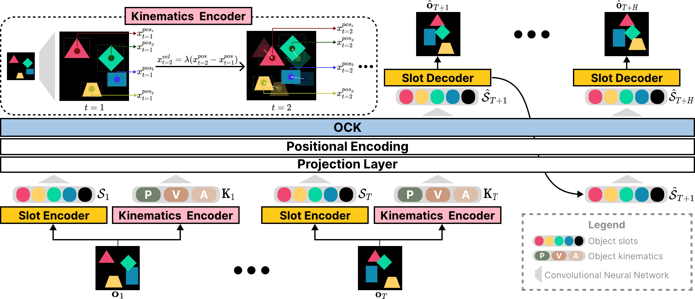

# OCK: Unsupervised Dynamics Prediction with Object-Centric Kinematics

[Yeon-Ji Song](https://yeonjisong.github.io/), &nbsp; Suhyung Choi, &nbsp; Jaein Kim, &nbsp; Jin-Hwa Kim, &nbsp; Byoung-Tak Zhang 

[ICCV 2025]() | <a href="" target="_blank">arXiv</a>



*Abstract*: Human perception involves discerning complex multi-object scenes into time-static object appearance (\ie, size, shape, color) and time-varying object motion (\ie, location, velocity, acceleration). This innate ability to unconsciously understand the environment is the motivation behind the success of dynamics modeling. Object-centric representations have emerged as a promising tool for dynamics prediction, yet they primarily focus on the objects' appearance, often overlooking other crucial attributes. In this paper, we propose Object-Centric Kinematics (OCK), a framework for dynamics prediction leveraging object-centric representations. Our model utilizes a novel component named object kinematics, which comprises low-level structured states of objects' position, velocity, and acceleration. The object kinematics are obtained via either implicit or explicit approaches, enabling comprehensive spatiotemporal object reasoning, and integrated through various transformer mechanisms, facilitating effective object-centric dynamics modeling. Our model demonstrates superior performance when handling objects and backgrounds in complex scenes characterized by a wide range of object attributes and dynamic movements. Moreover, our model demonstrates generalization capabilities across diverse synthetic environments, highlighting its potential for broad applicability in vision-related tasks.

## Introduction & Update
This is the official PyTorch Implementation for paper OCK.

Code Comming Soon!


## Implementation
We recommend using [conda](https://docs.conda.io/projects/conda/en/latest/user-guide/install/index.html) for environment setup. In our experiments, we use PyTorch 1.10.1 and CUDA 11.3:

```
conda create -n ock python=3.8.8
conda activate ock
conda install pytorch==1.10.1 torchvision==0.11.2 torchaudio==0.10.1 cudatoolkit=11.3 -c pytorch -c conda-forge
```

The codebase heavily relies on [SlotFormer](https://github.com/pairlab/SlotFormer). Please refer to the step-by-step guidance on how to install the requirements in SlotFormer.


## Dataset Preparation
All datasets should be downloaded or soft-linked to ./data/. All datasets should be downloaded or soft-linked to ./data/. Or you can modify the data_root value in the config files.

**OBJ3D**: This dataset is adopted from [G-SWM](https://github.com/zhixuan-lin/G-SWM#datasets).
Download it manually from the [Google drive](https://drive.google.com/file/d/1XSLW3qBtcxxvV-5oiRruVTlDlQ_Yatzm/view), or use the script provided in that repo.

**MOVi**:
Please download MOVi-{A-E} from the official [website](https://github.com/google-research/kubric/tree/main/challenges/movi).

**WAYMO**: Download Waymo Open Dataset from their official [website](https://waymo.com/open/). You may need to sign in with your Google account to request access.


## Experiments
The basic experiment pipeline in this project is:

1. Pre-train object-centric slot models `SAVi` on raw videos. After training, the models should be able to decompose the scene into meaningful objects, represented by a set of slots.
2. Apply pretrained object-centric model to extract slots from videos and save them to disk.
3. Train `OCK` over the extracted slots to learn the dynamics of videos.

### Pretrain SAVi
All of the model training can be done by specifying the task it belongs to, providing a config file (called `params` here), and adding other args. Please check the config file for the GPUs and other resources (e.g. `num_workers` CPUs) before launching a training.

For example, to train a SAVi model on OBJ3D dataset, simply run:
```
python scripts/train.py --task base_slots --params ock/base_slots/configs/savi_obj3d_params.py
```

Then you will need to extract slots and save them. Please use `extract_slots.py` and run:
```
python ock/base_slots/extract_slots.py \
    --params ock/base_slots/configs/savi_obj3d_params.py \
    --weight $WEIGHT \
    --save_path $SAVE_PATH (e.g. './data/OBJ3D/slots.pkl')
```
This will extract slots from OBJ3D videos and save them into a `.pkl` file.


### Train OCK 
Train an OCK model on extracted slots by running:

```
python scripts/train.py --task video_prediction \
    --params ock/video_prediction/configs/ock_{dataset}_params.py \
    --fp16 --ddp --cudnn
```


### Evaluate OCK
To evaluate the video prediction task, please use [test.py](../ock/video_prediction/test.py) and run:
```
python ock/video_prediction/test_vp.py \
    --params ock/video_prediction/configs/ock_{dataset}_params.py \
    --weight $WEIGHT
```
This will compute and print all the metrics.
Besides, it will also save 10 videos for visualization under `vis/obj3d/$PARAMS/`.
If you only want to do visualizations (i.e. not testing the metrics), simply use the `--save_num` args and set it to a positive value.

## Questions
If you have any questions, comments, or suggestions, please reach out to Yeon-Ji Song (yjsong@snu.ac.kr)
